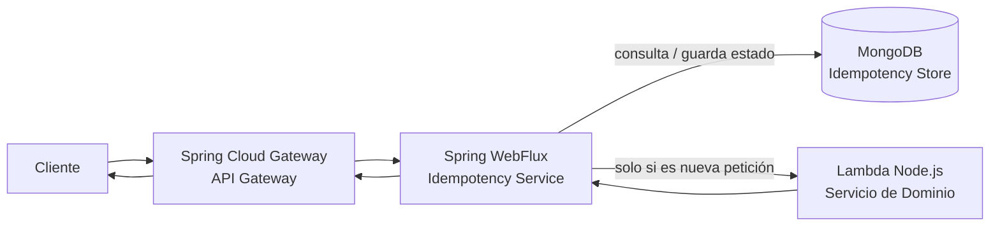
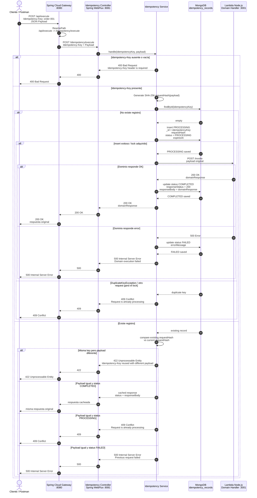
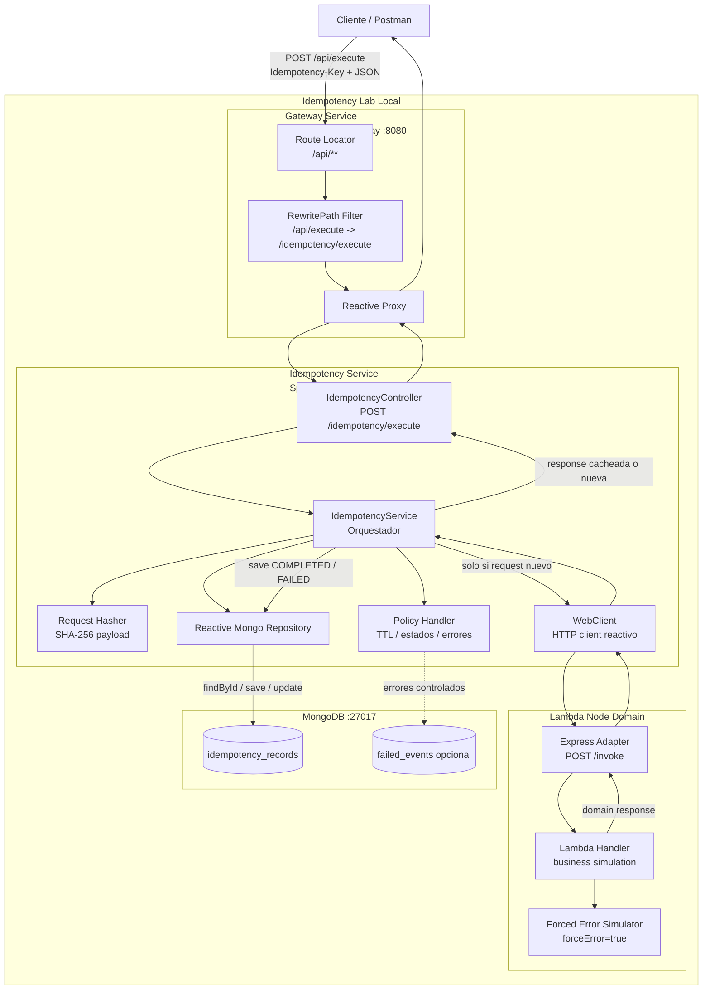

# Laboratorio Basico de Idempotencia


### Introducción:
Este laboratorio implementa un patrón de idempotencia independiente del dominio. 
1. El cliente envía una petición HTTP con un Idempotency-Key; 
2. API Gateway la enruta hacia un servicio WebFlux encargado de controlar si la operación debe ejecutarse, bloquearse o responderse desde una respuesta previamente almacenada.
3. El servicio de idempotencia válida la clave, calcula un hash del payload y consulta MongoDB para identificar el estado de la petición. 
4. Si la clave no existe, registra la operación como PROCESSING, invoca el servicio de dominio implementado en Node.js y guarda la respuesta final como COMPLETED. 
5. Si la misma petición se repite con la misma clave y el mismo payload, el sistema no vuelve a ejecutar el dominio, sino que retorna la respuesta cacheada.
6. Si la clave se reutiliza con un payload diferente, el sistema responde con error 422. 
7. Si otra petición con la misma clave aún está en proceso, responde con 409. 
8. De esta forma, el componente evita duplicidad de operaciones, mantiene consistencia y puede reutilizarse para distintos casos de negocio sin depender de la lógica interna del dominio.

---

- Diagrama General:

```
         Cliente
            ↓
    Spring Cloud Gateway
            ↓
Servicio de Idempotencia
    ↓               ↓
 MongoDB      Lambda Node.js
```

---

- Diagrama de Flujo:


---

- Diagrama de Secuencia:



---

- Diagrama de Componentes:



---

### Licencia:
Este proyecto está bajo la Licencia MIT. Consulta el archivo LICENSE para más detalles.

### Autor:
- [Raul R. Bolivar Navas](https://github.com/raulrobinson/idempotency-lab-opensource)
